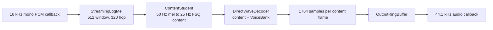

# E2E Streaming Runtime

Date: 2026-06-14

## Runtime Contract

The production core accepts mono `float32` PCM at 16 kHz and emits mono PCM at
44.1 kHz. It contains no future lookahead and keeps bounded state.



`astrape.streaming_pipeline.StreamingVoiceConverter` owns all model and
frontend states. A caller passes arbitrary input chunk sizes to `process()` and
receives zero or more output samples. `flush()` ends one utterance and emits any
pending content frame. `reset()` starts a new utterance.

## VoiceBank V2

The VoiceBank remains one immutable embedding from one continuous recording.
The decoder receives the exact Mio global embedding; the runtime does not
average, normalize, interpolate, or otherwise move it off the teacher's learned
conditioning distribution.

Version 2 adds:

- exact embedding model identifier for decoder compatibility checks;
- source SHA-256 and UTC creation time for reproducibility;
- source duration and sample rate;
- peak, RMS dBFS, clipping fraction, active-speech ratio, and DC offset;
- explicit quality warnings;
- backward-compatible loading of version 1 files.

The minimum remains five seconds. Longer recordings are accepted without a
fixed upper bound. Internal segmentation is not used to manufacture multiple
references.

Quality diagnostics are advisory. They do not silently edit the recording.
Poor references should be rerecorded because denoising, loudness normalization,
or embedding averaging can change identity and requires separate validation.

## Scheduling

The inference worker is single-owner: only one thread mutates model states.

1. The input callback writes 16 kHz samples to a lock-free or bounded queue.
2. The inference worker drains available samples and calls `process()`.
3. The causal log-mel frontend keeps its small waveform state on CPU and
   transfers only completed mel frames to the accelerator.
4. Each content frame immediately produces exactly 1,764 output samples.
5. The worker writes model output to a bounded, lock-protected
   `OutputRingBuffer`.
6. The output callback reads its device-sized block. Missing samples are
   zero-filled and counted as underruns.

Models are warmed before callbacks start. A VoiceBank or model change happens
only at an utterance boundary after draining output and resetting state.

Do not batch adjacent content frames merely to improve throughput. That adds a
40 ms collection delay. The content model may process the first mel frame
immediately and then follow its existing odd/even streaming schedule.

## Latency Budget

| Component | Current budget |
|---|---:|
| First causal STFT collection | 32-35 ms |
| Content student p95 | about 31 ms |
| Direct waveform decoder p95 | about 10 ms |
| Transfer and callback margin | about 4 ms |
| Expected callback-to-first-output | about 77 ms |

The output ring buffer adapts block sizes; it is not a lookahead buffer. Audio
may be played as soon as the first generated samples arrive.

An integrated MPS smoke test with the current content checkpoint and an
untrained waveform checkpoint measured about 37.1 ms for content and 11.9 ms
for waveform generation plus CPU transfer. Moving the causal frontend state to
CPU and transferring only completed mel frames reduced file-driver RTF from
1.504 to 1.174, or roughly 47 ms per 40 ms content frame. It does not yet pass
the 40 ms gate. This is a measured optimization requirement, not a hidden
buffer.

Before production sign-off, reduce this cost through the trained decoder
profile and content inference optimization or a smaller validated content
runtime tier. Do not recover throughput by batching future content frames.

The core requires 16 kHz input so a hidden high-quality resampler cannot consume
the latency budget. If hardware only exposes 44.1 or 48 kHz input, benchmark a
separate causal input adapter and include its group delay in the 100 ms gate.
Prefer configuring capture directly to 16 kHz. Configure playback to 44.1 kHz
to avoid an output resampler.

## Failure And Recovery

- Reject non-finite PCM, incompatible embedding dimensions, and mismatched
  VoiceBank embedding model IDs.
- Count output underruns instead of blocking the audio callback.
- Never reuse a flushed state. Call `reset()` before the next utterance.
- On device or model failure, stop inference, clear both queues, reset all
  states, warm the models, and restart callbacks.
- Keep silence in the timeline. A VAD may suppress transport or UI work but
  must not alter the core frame clock without an explicit discontinuity reset.

## Ready-To-Run Path

Once trained checkpoints exist:

```bash
.venv/bin/python run_streaming_e2e.py \
  --input source.wav \
  --voicebank voicebanks/target.npz \
  --content-checkpoint checkpoints/content_student_768x10_fsq.best.pt \
  --wave-checkpoint checkpoints/direct_wave_decoder.best.pt \
  --output outputs/e2e.wav \
  --device mps \
  --chunk-ms 5
```

This command is a file-driven streaming simulation. File resampling occurs
before timing starts and is not part of the production latency claim.

## Acceptance Gates

- full and irregular-chunk outputs match within `2e-6`;
- no future-prefix change in either model;
- exactly 1,764 output samples per content frame;
- bounded content attention, convolution caches, and output queue;
- first output below 100 ms including device callbacks;
- steady inference below 40 ms per content frame;
- zero output underruns after startup;
- no click at ordinary chunk boundaries or utterance flush;
- target VoiceBank similarity and source-content preservation meet held-out
  quality gates.

The software path and tests are implemented. Production sign-off still depends
on the trained content and direct waveform checkpoints plus a live audio-device
benchmark.
